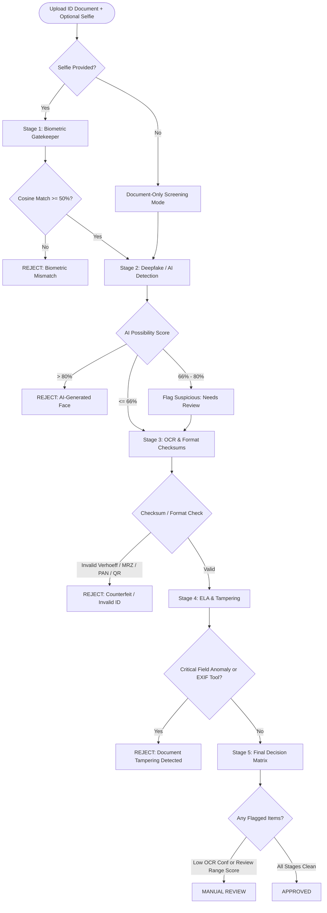

# 🔍 Veri-Byte — Forensic Document Inspector

**AI-Based Fake Identity & Document Screening System**  
*Smart India Hackathon 2026 — Problem Statement SIH26188*  
*Ministry of Home Affairs | Blockchain & Cybersecurity*

---

A state-of-the-art, high-throughput forensic analysis platform engineered to screen Indian national identity documents and travel credentials for digital tampering, data forgery, synthetic deepfake injection, and cryptographic invalidity.

Veri-Byte combines **InsightFace** biometrics, a **SigLIP neural deepfake classifier**, **Tesseract OCR + PassportEye MRZ extraction**, UIDAI **Verhoeff checksum validation**, adaptive **Error Level Analysis (ELA)**, and **EXIF metadata inspection** into a unified, deterministic decision pipeline delivered via an asynchronous FastAPI backend and a cyber-forensic React Single-Page Application (SPA).

---

## 📑 Table of Contents

- [Key Capabilities](#-key-capabilities)
- [System Architecture](#-system-architecture)
- [Forensic Analysis Pipeline](#-forensic-analysis-pipeline)
- [Decision Matrix](#-decision-matrix)
- [Project Directory Structure](#-project-directory-structure)
- [Prerequisites & Requirements](#-prerequisites--requirements)
- [Quick Start Guide](#-quick-start-guide)
- [Configuration & Thresholds](#-configuration--thresholds)
- [API Reference](#-api-reference)
- [Privacy & Security Compliance](#-privacy--security-compliance)
- [Troubleshooting & FAQs](#-troubleshooting--faqs)

---

## 🌟 Key Capabilities

### 1. Dual Operational Screening Modes
- **Full Identity Verification Mode**: Compares the portrait on an uploaded government ID against a live webcam capture or selfie photo using InsightFace deep embeddings. Acts as an instant biometric gatekeeper (rejects if similarity < 50%).
- **Document-Only Screening Mode**: Eliminates the selfie requirement for rapid batch screening, back-office verification, customs pre-clearance, and automated KYC pipelines. Seamlessly performs all format, deepfake, OCR, ELA tampering, and metadata checks.

### 2. Multi-Signal Deepfake & AI-Generation Detection
Guards against AI-generated faces (StyleGAN, Stable Diffusion, Midjourney, Flux) using a weighted multi-signal ensemble:
- **SigLIP Neural Classifier (60% weight)**: Fine-tuned `prithivMLmods/deepfake-detector-model-v1` providing direct binary classification probabilities.
- **Texture Uniformity Analysis (15% weight)**: Evaluates grid-based Laplacian variance across the face crop; detects unnatural uniformity in synthetic images.
- **FFT High-Frequency Spectral Noise (10% weight)**: Fast Fourier Transform frequency domain analysis measuring natural sensor noise deficits.
- **Skin Chrominance Uniformity (10% weight)**: Analyzes natural color variation in the YCbCr color space.
- **Facial Landmark Symmetry (5% weight)**: Measures horizontal bilateral symmetry (GAN-generated faces exhibit abnormal micro-symmetry).

### 3. Domestic Identity & Cryptographic Checksum Validation
- **UIDAI Aadhaar Checksum (Verhoeff Algorithm)**: Full implementation of the dihedral group $D_5$ Verhoeff algorithm. Validates 12-digit Aadhaar numbers, detects single-digit substitutions and adjacent transposition errors, enforces leading-digit rules (disallows 0 and 1), and flags repetitive patterns.
- **UIDAI Virtual ID (VID)**: Validates 16-digit VID format and structure.
- **Income Tax Permanent Account Number (PAN)**: Enforces regex `[A-Z]{5}[0-9]{4}[A-Z]` and decodes the 4th character entity type (`P` - Individual, `C` - Company, `H` - HUF, `F` - Firm/LLP, `T` - Trust, `G` - Government, etc.).
- **Voter ID (EPIC)**: Format pattern validation for Indian voter credentials.
- **Passport MRZ Checksums**: ICAO 9303 Machine Readable Zone (MRZ) parser verifying composite check digits on passport number, date of birth, and expiration date.
- **Secure QR Code & Barcode Verification**: Scans embedded barcodes/QR codes via `zxingcpp` to identify official UIDAI signed payloads or flag suspicious phishing/non-government URLs.

### 4. Adaptive Error Level Analysis (ELA) & Tampering Detection
- **Layout-Aware Inspection**: Evaluates compression artifacts against document-specific spatial zone maps (Passport, standard ID cards, and vertical Aadhaar letter layouts).
- **Amplified Heatmap Generation**: Recompresses images at 90% JPEG quality, computes pixel difference maps, amplifies by $\times 15$, and overlays detected anomalies.
- **Critical Field Protection**: Flagged anomalies in critical areas (Photo, Name, Date of Birth, ID number, MRZ) trigger immediate rejection.
- **EXIF Metadata Auditing**: Identifies trace metadata left by editing suites (Adobe Photoshop, GIMP, Canva, CorelDRAW).

### 5. Cyber-Forensic React User Interface
- **Real-Time Streaming**: Asynchronous Server-Sent Events (SSE) feed step-by-step progress to an interactive 5-stage visual stepper.
- **Flexible Input Capture**: Drag-and-drop file upload, clipboard paste support (`Ctrl + V`), and live webcam integration with real-time video mirroring and canvas snapshots.
- **Visual Diagnostics**:
  - **Verdict Banner**: Color-coded glowing status badge (Approved, Rejected, Manual Review).
  - **5 Core KPI Cards**: Document Type & Checksum Status, OCR Confidence %, Integrity Status, Biometric Match %, and Deepfake Risk Score.
  - **Deepfake Breakdown**: Progress bars for each sub-signal in the detection ensemble.
  - **ELA Heatmap Visualizer**: Side-by-side comparison of original document vs forensic error level heatmap.
  - **OCR Inspector**: Tabbed view switching between structured key-value identity fields and raw text dump with one-click clipboard copy.
  - **Audit Report Viewer**: Formatted Markdown forensic audit report with instant text export and copy actions.

---

## 🏛 System Architecture

```
                               ┌──────────────────────────────────────────────┐
                               │           Client Browser (React SPA)         │
                               │  - Live Webcam & Image Drag / Drop / Ctrl+V  │
                               │  - Real-time 5-Stage SSE Stepper & KPI Cards │
                               │  - ELA Heatmap Comparison & OCR Inspector    │
                               └──────────────────────┬───────────────────────┘
                                                      │
                         HTTP POST /api/analyze (SSE) │  Static Assets (dist/)
                                                      ▼
┌─────────────────────────────────────────────────────────────────────────────────────────────────────────┐
│                                FastAPI Forensic Backend (127.0.0.1:8000)                               │
│                                                                                                         │
│  [server.py]                                                                                            │
│   ├── Serves React Production Build (dist/index.html)                                                   │
│   ├── /api/health       → System health, model statuses & active thresholds                             │
│   ├── /api/analyze      → Server-Sent Events (SSE) streaming pipeline                                   │
│   ├── /api/analyze/sync → Synchronous JSON fallback payload                                             │
│   └── Temp File Manager → Transient disk storage with guaranteed cleanup                                │
└─────────────────────────────────────────────────────┬───────────────────────────────────────────────────┘
                                                      │
                                                      ▼
┌─────────────────────────────────────────────────────────────────────────────────────────────────────────┐
│                                Forensic Agent Pipeline (agent/forensic_agent.py)                         │
│                                                                                                         │
│  Stage 1 ▶ Biometric Gatekeeper (InsightFace buffalo_l)                                                 │
│            • Compares document portrait vs live webcam selfie                                           │
│            • Score < 50% → Immediate REJECT | Omitted → Document-Only Screening Mode                     │
│                                                                                                         │
│  Stage 2 ▶ Deepfake / AI-Generation Check (agent/deepfake_detector.py)                                  │
│            • SigLIP Neural Model (prithivMLmods/deepfake-detector-model-v1, 60%)                        │
│            • Texture Uniformity (15%) + FFT Noise (10%) + YCbCr Skin (10%) + Symmetry (5%)              │
│            • AI Score > 80% → REJECT | AI Score > 66% → MANUAL REVIEW                                   │
│                                                                                                         │
│  Stage 3 ▶ OCR Extraction & Format/Checksum Validation                                                  │
│            • Tesseract OCR 5 with contrast normalization & 2x adaptive upscaling                        │
│            • PassportEye ICAO 9303 MRZ parsing and check digits                                         │
│            • Verhoeff Checksum Algorithm (UIDAI Aadhaar 12-digit check)                                 │
│            • PAN Entity Code Classification & Voter ID EPIC pattern matching                            │
│            • QR / Barcode scanning (zxingcpp) for official UIDAI signatures                             │
│                                                                                                         │
│  Stage 4 ▶ Error Level Analysis (ELA) & Tampering Detection                                             │
│            • Re-compression difference heatmap (scale x15, quality 90)                                  │
│            • Layout-aware zonal mapping (Aadhaar letter, ID card, Passport)                             │
│            • EXIF metadata scan for editing software signatures                                         │
│                                                                                                         │
│  Stage 5 ▶ Deterministic Decision Matrix & Forensic Audit Report                                        │
│            • Evaluates all cross-stage telemetry into APPROVED / REJECT / MANUAL REVIEW                 │
│            • Generates full structured Markdown forensic audit report                                   │
└─────────────────────────────────────────────────────────────────────────────────────────────────────────┘
```

---

## 🔬 Forensic Analysis Pipeline



---

## ⚖️ Decision Matrix

Veri-Byte relies on a **deterministic decision matrix** to eliminate non-deterministic hallucinations in security-critical identity screening:

| Condition | Verdict | Primary Action |
|---|---|---|
| Biometric match < 50.0% (when selfie provided) | **REJECT** | Fast-fail gatekeeper rejection |
| AI-generation possibility > 80.0% | **REJECT** | Synthetic / AI-injected portrait flagged |
| Aadhaar Verhoeff checksum failure or invalid format | **REJECT** | Counterfeit or malformed Aadhaar number |
| Passport MRZ check-digit verification failure | **REJECT** | Tampered travel credential / altered MRZ |
| Invalid PAN syntax or unrecognized entity code | **REJECT** | Malformed / fraudulent tax ID number |
| Critical zone tampering detected via ELA | **REJECT** | Altered Photo, Name, DOB, or ID Number field |
| Photo editing software identified in EXIF metadata | **REJECT** | Image manipulation signature detected |
| AI-generation possibility between 66.0% and 80.0% | **MANUAL REVIEW** | Suspicious synthetic facial features |
| Biometric match between 50.0% and 60.0% | **MANUAL REVIEW** | Borderline facial resemblance |
| Average OCR extraction confidence < 40.0% | **MANUAL REVIEW** | Degraded, blurry, or low-resolution scan |
| Non-critical ELA zone irregularities | **MANUAL REVIEW** | Background noise or minor recompression artifact |
| All checks valid, biometric > 60%, AI ≤ 66%, no tampering | **APPROVED** | Genuine, untampered identity document |

---

## 📂 Project Directory Structure

```
Al-Based Fake Identity & Document Screening System/
├── backend/                             # FastAPI Backend & Forensic Engine
│   ├── server.py                        # FastAPI entry point, SSE streaming, static hosting
│   ├── config.py                        # Centralized thresholds, zone layouts, regex patterns
│   ├── requirements.txt                 # Backend Python package requirements
│   ├── temp_uploads/                    # Transient storage (auto-wiped after every analysis)
│   ├── agent/                           # Forensic pipeline modules
│   │   ├── __init__.py                  # Public exports (run_analysis, TypedDict contracts)
│   │   ├── forensic_agent.py            # Master pipeline generator & decision matrix
│   │   ├── deepfake_detector.py         # SigLIP neural model + 4 CV heuristic ensemble
│   │   ├── face_engine.py               # InsightFace biometric verification engine
│   │   └── types.py                     # TypedDict data contracts across all stages
│   └── utils/                           # Core utilities
│       ├── __init__.py                  # Package re-exports
│       ├── verhoeff.py                  # UIDAI Aadhaar Verhoeff algorithm & PAN/VID validators
│       └── image_utils.py               # File validation, transient saving, secure cleanup
│
├── frontend/                            # Cyber-Forensic React SPA (Vite)
│   ├── index.html                       # Application shell & Google Fonts (Outfit / Inter)
│   ├── vite.config.js                   # Vite dev server configuration & backend proxy
│   ├── package.json                     # Node.js dependencies & scripts
│   ├── dist/                            # Production bundle served directly by FastAPI
│   └── src/
│       ├── main.jsx                     # React DOM mount point
│       ├── App.jsx                      # Application state, SSE client, layout orchestration
│       ├── index.css                    # Design tokens, color system, typography
│       ├── App.css                      # Glassmorphism, animations, cyber-aesthetic layout
│       └── components/                  # Modular React UI components
│           ├── Header.jsx               # Navigation bar, API health status indicator, reset action
│           ├── UploadSection.jsx        # Dual-mode selector, drag-drop, paste (Ctrl+V), live webcam
│           ├── PipelineStepper.jsx      # 5-stage animated real-time progress indicator
│           ├── VerdictBadge.jsx         # Glowing verdict banner with status breakdown
│           ├── MetricsRow.jsx           # 5 Core forensic KPI metric cards
│           ├── DeepfakeBreakdown.jsx    # Neural classifier and CV heuristic score breakdown
│           ├── ElaComparison.jsx        # Side-by-side original vs ELA heatmap visualizer
│           ├── OcrInspector.jsx         # Checksum banner, structured fields & raw text dump
│           └── ReportViewer.jsx         # Formatted Markdown audit report viewer & text exporter
│
├── requirements.txt                     # Convenience root pointer to backend/requirements.txt
├── run_dev.bat                          # Concurrent dev launcher (FastAPI + Vite Hot Reload)
├── run_system.bat                       # Single-command launcher for Windows (Localhost:8000)
└── README.md                            # Comprehensive system documentation
```

---

## 💻 Prerequisites & Requirements

### System Requirements
- **Operating System**: Windows 10/11, macOS, or Linux (x86_64).
- **Python**: Version 3.10 or higher.
- **Node.js**: Version 18.0 or higher (for frontend development/building).
- **Memory**: Minimum 8 GB RAM (16 GB recommended when running neural SigLIP deepfake model on CPU).
- **Disk Space**: ~2 GB free disk space (for Python virtualenv and downloaded model weights).

### External Binaries
1. **Tesseract OCR**:
   - **Windows**: Install [UB-Mannheim Tesseract OCR](https://github.com/UB-Mannheim/tesseract/wiki). Default install path: `C:\Program Files\Tesseract-OCR\tesseract.exe`.
   - **Linux**: `sudo apt-get install tesseract-ocr`
   - **macOS**: `brew install tesseract`

---

## 🚀 Quick Start Guide

### Option A: Production Mode (Single-Command Run)
The production bundle is precompiled inside `frontend/dist/`. FastAPI serves the React UI and API endpoints together on port `8000`.

1. **Via Batch Script (Windows)**:
   Double-click `run_system.bat` from the project root.

2. **Via Command Line**:
   ```bash
   # Activate virtual environment
   .\venv\Scripts\activate      # Windows
   # source venv/bin/activate    # Linux / macOS

   # Launch server
   cd backend
   python server.py
   ```
3. Open your browser and navigate to:
   - **Web Application**: `http://127.0.0.1:8000`
   - **Interactive API Documentation (Swagger)**: `http://127.0.0.1:8000/docs`

---

### Option B: Development Mode (Hot-Reloading)
For developing and modifying React components or styling with instantaneous hot module replacement (HMR).

1. **Via Batch Script (Windows)**:
   Double-click `run_dev.bat` from the project root.

2. **Via Command Line**:
   ```bash
   # Terminal 1: Backend Server
   .\venv\Scripts\activate
   cd backend
   python server.py

   # Terminal 2: React Dev Server (Vite)
   cd frontend
   npm run dev
   ```
3. Open `http://127.0.0.1:5173` in your browser. Vite automatically proxies `/api` calls directly to the local backend on port `8000`.

---

### Building the Frontend from Source
Whenever you make updates to React source code in `frontend/src/`:
```bash
cd frontend
npm install
npm run build
```
This updates `frontend/dist/`, which FastAPI serves automatically.

---

## ☁️ Cloud Deployment (Vercel + Backend)

Veri-Byte uses a decoupled microservice architecture optimized for cloud deployment:
- **Frontend (React / Vite UI)**: Deployed globally on **Vercel** with automatic CDN edge delivery and instant preview branches.
- **Backend (Python AI Engine)**: Deployed as a containerized Docker service on **Render**, **Railway**, **Fly.io**, or **Hugging Face Spaces** (where PyTorch, InsightFace, and Tesseract OCR run with dedicated CPU/GPU).

### 1. Deploy Frontend on Vercel (1-Click)
1. Go to [Vercel Dashboard](https://vercel.com) and click **"Add New Project"** -> **"Import Git Repository"**.
2. Select this repository (`ashmitsamanta/Ai_based-fake-identity-detection-system`).
3. Vercel will automatically detect [`vercel.json`](vercel.json) and [`package.json`](package.json):
   - **Framework Preset**: `Vite`
   - **Build Command**: `npm run build`
   - **Output Directory**: `frontend/dist`
4. *(Optional)* Add the Environment Variable in Vercel:
   - **Key**: `VITE_API_URL`
   - **Value**: `https://your-backend-service.onrender.com` (your deployed backend URL).
5. Click **Deploy**. Your frontend is live with SSL at `https://<your-project>.vercel.app`!

### 2. Deploy AI Backend on Cloud (Render / Railway / Docker)
The repository includes a production-ready [`Dockerfile`](Dockerfile) with pre-installed Tesseract-OCR, system C++ libraries, InsightFace, and PyTorch:
- **Render.com**: Connect the repo and click **New Web Service** -> select **Docker** (or use [`render.yaml`](render.yaml) blueprint).
- **Railway.app**: Click **New Project** -> **Deploy from GitHub repo** -> Railway detects the `Dockerfile` automatically.
- **Environment Variables**:
  - `PORT=8000`
  - `CORS_ORIGINS=https://<your-project>.vercel.app` (or `*`)
  - `ENABLE_NEURAL_DEEPFAKE=true`

---

## ⚙️ Configuration & Thresholds

All tunable thresholds and heuristic weights are maintained in [`backend/config.py`](backend/config.py):

### Detection Thresholds

| Setting | Default | Description |
|---|---|---|
| `BIOMETRIC_REJECT_THRESHOLD` | `50.0` | Cosine similarity below this value immediately rejects the identity. |
| `BIOMETRIC_REVIEW_THRESHOLD` | `60.0` | Match scores between 50% and 60% trigger Manual Review. |
| `DEEPFAKE_REJECT_THRESHOLD` | `80.0` | AI-generation possibility above this threshold triggers instant rejection. |
| `DEEPFAKE_REVIEW_THRESHOLD` | `66.0` | AI-generation possibility between 66% and 80% flags for Manual Review. |
| `OCR_CONFIDENCE_THRESHOLD` | `40.0` | Minimum average word extraction confidence required to pass automatically. |
| `ENABLE_NEURAL_DEEPFAKE` | `true` | Enables SigLIP neural model. Set to `false` in low-RAM environments to use CV heuristics only. |

### Deepfake Ensemble Signal Weights

| Signal Key | Weight | Method & Measurement |
|---|---|---|
| `neural_detector` | **0.60** | SigLIP transformer model fine-tuned on synthetic faces. |
| `texture_uniformity` | **0.15** | Coefficient of variation across facial Laplacian variance blocks. |
| `fft_score` | **0.10** | High-frequency radial energy falloff in frequency domain. |
| `skin_uniformity` | **0.10** | Chrominance dispersion in YCbCr color space. |
| `symmetry_score` | **0.05** | Bilateral facial landmark distance delta across horizontal axis. |

### Error Level Analysis (ELA) Parameters

| Setting | Default | Purpose |
|---|---|---|
| `ELA_QUALITY` | `90` | Recompression quality level for baseline difference calculation. |
| `ELA_SENSITIVITY` | `25` | Per-pixel difference threshold to consider an anomaly. |
| `ELA_SCALE_FACTOR` | `15` | Multiplier for amplifying visualization heatmap pixels. |
| `ELA_MIN_REGION_AREA`| `500` | Minimum contiguous affected pixels required to flag a zone. |

---

## 🔌 API Reference

### 1. Health & Configuration
```http
GET /api/health
```
**Response**:
```json
{
  "status": "healthy",
  "service": "Veri-Byte Document Inspector",
  "models": {
    "biometric": "InsightFace buffalo_l",
    "deepfake": "prithivMLmods/deepfake-detector-model-v1",
    "ocr": "Tesseract OCR"
  },
  "neural_deepfake_enabled": true,
  "thresholds": {
    "biometric_reject": 50.0,
    "biometric_review": 60.0,
    "deepfake_reject": 80.0,
    "deepfake_review": 66.0,
    "ocr_confidence": 40.0
  }
}
```

---

### 2. Stream Analysis (Server-Sent Events)
```http
POST /api/analyze
Content-Type: multipart/form-data
```
**Parameters**:
- `id_file` (Required): Identity document image file (JPEG, PNG, WebP).
- `selfie_file` (Optional): Live selfie image file.
- `selfie_data` (Optional): Base64 Data URL string from webcam snapshot.

> **Note:** If neither `selfie_file` nor `selfie_data` is supplied, the pipeline automatically runs in **Document-Only Screening Mode**.

**Event Stream Payloads**:
Yields JSON objects with `step`, `status`, and `message`. On completion, the final event contains:
```json
{
  "step": "verdict",
  "status": "complete",
  "message": "Final verdict: APPROVED",
  "verdict": "APPROVED",
  "report": "# Forensic Document Screening Report\n...",
  "results": {
    "biometric": { "match_confidence": 88.4, "raw_verified": true },
    "deepfake": { "is_ai_generated": false, "confidence": 12.3, "signals": { ... } },
    "ocr": {
      "id_type": "AADHAAR",
      "confidence": 86.0,
      "format_valid": true,
      "fields": { "id_number": "9999 1234 5678", "checksum_status": "PASSED" },
      "validation_reasons": ["Valid UIDAI Aadhaar number format (Verhoeff checksum passed)"]
    },
    "tampering": {
      "integrity_status": "CLEAN",
      "flagged_zones": [],
      "critical_flagged": []
    }
  },
  "ela_image_base64": "data:image/jpeg;base64,..."
}
```

---

### 3. Synchronous Analysis Endpoint
```http
POST /api/analyze/sync
Content-Type: multipart/form-data
```
Identical input parameters to `/api/analyze`, returning the complete forensic assessment in a single JSON payload upon pipeline termination.

---

## 🔒 Privacy & Security Compliance

- **Zero Data Retention**: All uploaded documents, webcam snapshots, and intermediate ELA differential files stored in `backend/temp_uploads/` are automatically deleted immediately after each pipeline run completes.
- **Local Execution**: All biometric embeddings, neural inference, OCR reading, and cryptographic checks execute strictly within the local host environment (`127.0.0.1`), ensuring sensitive citizen PII never leaves the boundary.
- **In-Memory ELA Transmission**: ELA heatmaps are encoded directly to Base64 strings, embedded into the transient event stream, and purged from disk.

---

## ❓ Troubleshooting & FAQs

### 1. `TesseractNotFoundError`
- **Cause**: Tesseract OCR binary is not installed or not located at `C:\Program Files\Tesseract-OCR\tesseract.exe`.
- **Fix**: Install Tesseract from UB-Mannheim, or set the environment variable pointing to your binary:
  ```bash
  set TESSERACT_CMD=C:\Your\Path\To\tesseract.exe
  ```

### 2. InsightFace Initial Model Download
- **Note**: On the very first run, InsightFace downloads the `buffalo_l` model weights (~200 MB) into `~/.insightface/models/`. Subsequent startups load instantly from disk cache.

### 3. Running Without a Dedicated GPU
- The system is configured by default with `CPUExecutionProvider` for InsightFace and auto-detects CUDA for PyTorch. If running on low-memory hardware, you can disable the neural deepfake classifier by setting `ENABLE_NEURAL_DEEPFAKE=false` in your environment, which shifts to the lightweight computer-vision heuristic ensemble.

### 4. Webcam Access Blocked
- If your browser blocks webcam access, you can either grant camera permissions in browser site settings or switch to the **"Upload Image"** tab in the selfie panel. You can also proceed without a selfie to use **Document-Only Screening Mode**.

---

## 📜 License & Accreditation

Developed for **Smart India Hackathon 2026** under Problem Statement **SIH26188**.  
Maintained by the Veri-Byte Team. For technical inquiries and contributions, please refer to the project repository.
